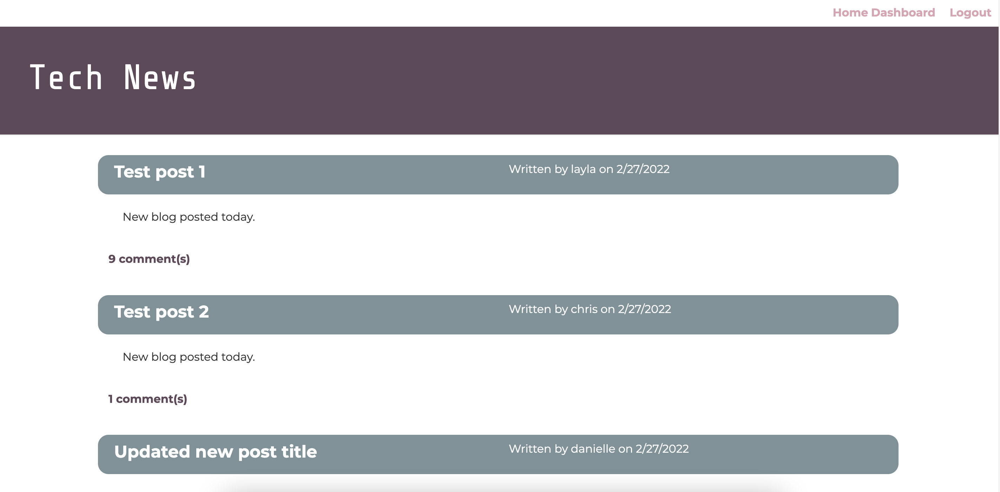

## Tech Blog

# Table of Contents
* Languages
* Link
* Preview
* Installation
* Usage
* License

# Languages
This project was built with JavaScript, Node, Express, Handlebars, and MySql.

# Link
https://github.com/daniellefortin2021/tech-blog

# Preview 

# Installation
Install Node.JS on your computer by running npm install in the command line. Then, clone the repository to your computer.

# Usage
To start using the application, install MySql in your command line and then import the database with source db/schema.sql. Then start the application with npm start. Once you've got the application running, you will be able to add posts, add comments to posts, and edit posts with the blog.

# License 
This project is licensed under MIT.

